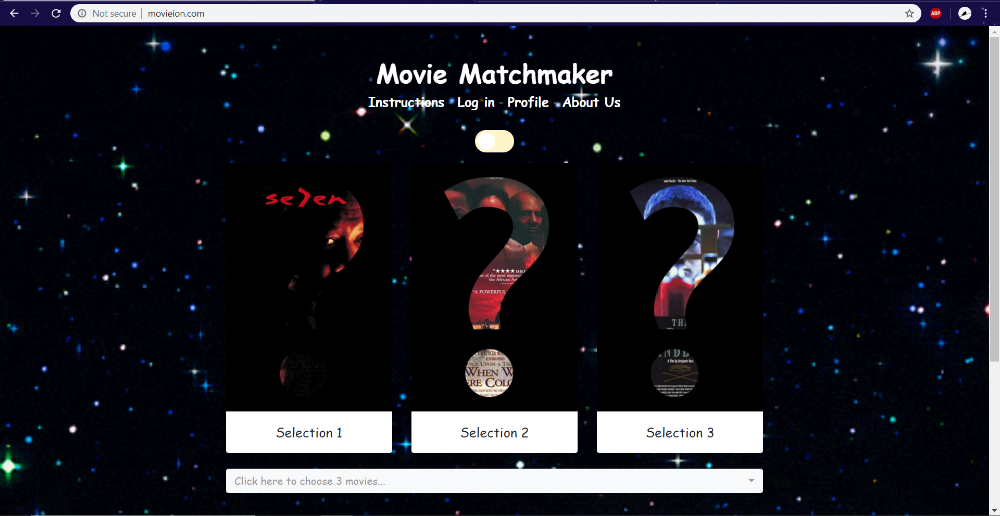

# Introduction
Movie Matchmaker is a group project for Washington Univeristy's Data Analytics Boot Camp. For this project, we created a web app that uses a machine learning model to recommend movies. For a short while, the app will be available online at www.movieion.com. Below is an overview and demonstration of the app.

# Technologies used:

   - IDEs (VS Code and Jupyter Notebook)
   - Web Scraping (Python-Splinter)
   - Data Wrangling (Pandas, pgAdmin)
   - Machine Learning (sklearn, scipy, and joblib)
   - Storage (PostgreSQL and S3 Bucket)
   - Backend (Python-Flask)
   - Frontend (JavaScript, Bootstrap 4, HTML5/CSS3, jQuery, ajax)
   - Web Host (AWS)

# Demonstration:

# Challenges:

Learning a new database management system  (PostgreSQL & pgAdmin)
Certain libraries were incompatible with web host (psycorpg)
Data formatting required new libraries to properly clean and use
Machine learning model required more RAM than standard web app, therefore sustainability, price, and processing speed were issues
Bootstrap library for UI required ajax and jQuery to properly pass data between frontend and backend
Bootstrap library was formatting data

(Last updated 7/25/2019)
