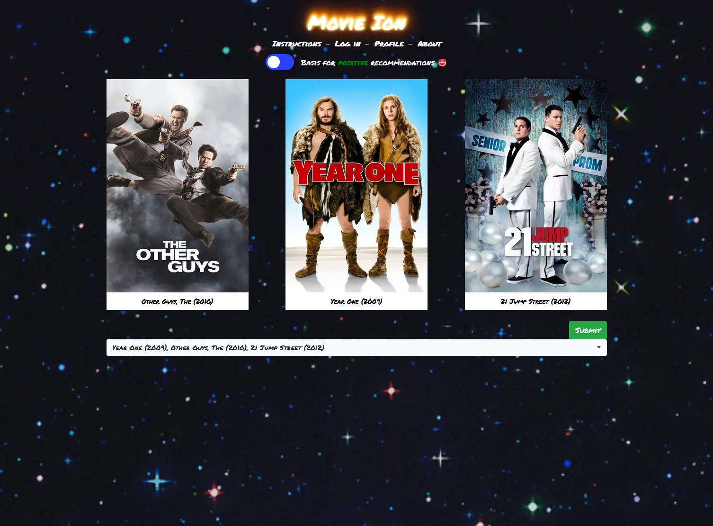

# Movie Ion

_Movie Ion_ (originally named _Movie Matchmaker_) was a group project for _Washington University's Data Analytics Boot Camp (2019)_. For this project, we created a web application that uses machine learning to recommend movies in terms of what the user will likely enjoy or movies the user is least likely to enjoy.



## Table of Contents

- [The team](#the-team-by-github-username)
- [Overview](#overview)
- [Technologies Used](#technologies-used)
- [Known bugs](#known-bugs)
- [How to run locally (WIP)](#how-to-run-locally)
  - [Run on Windows](#run-on-windows)
  - [Run on Docker](#run-on-docker)
- [Screenshots](#screenshots)
  - [Desktop](#desktop)
  - [Mobile](#mobile)

# The team (by GitHub username)

- [@kamilevy](https://github.com/kamilevy)
- [@feldsteina](https://github.com/feldsteina)
- [@dperkins2315](https://github.com/dperkins2315)
- [@theodoremoreland](https://github.com/theodoremoreland)

# Overview:

At the Home screen, select three of your favorite movies from the dropdown menu (select a movie a second time to remove the selection). Once your movies are selected, click the green "Submit" button to process your selections.

By default, the application will recommend movies that you are likely to enjoy. Alternatively, by toggling the slider above the movie posters (on the Home screen), the application will recommend movies that you are likely to dislike.

Upon receiving your recommendations, you can click on the movie posters to view information about the movie, including the movie's title, release date, a brief synopsis, and more. This feature is also available via clicking posters selected on the Home screen.

When viewing a movie's information, you can click the "Add to Watchlist" button to add the movie to your watchlist. You must be logged in as user1, user2, user3, user4, user5, or user6 to add movies to your watchlist. There is no password for any of these accounts as they are for demonstration purposes only.

_Note: Watchlist and user accounts were implemented to exercise and demonstrate authentication, user sessions, and database functionality. It serves no practical purpose beyond that._

# Technologies used:

- Web Scraping (Python, Splinter)
- Data Wrangling (Pandas, SQL)
- Machine Learning (sklearn, scipy, and joblib)
- Storage (PostgreSQL, S3 Bucket)
- Backend (Python, Flask)
- Frontend (JavaScript, Bootstrap 4, HTML5/CSS3, jQuery, ajax)
- Containerization (Docker)
- Web Host (AWS)

# How to run locally

Whether you are running the app directly on a Windows OS or indirectly via Docker, there are a few things you need to do in order to setup the application:

- You need your own PostgreSQL database instance.
- You need to create a file in `application/modules/` called `config.py` mimicking the template provided in `application/modules/config.py.example` wherein the empty strings are replaced with values relating to a connection to your PostgreSQL database instance.
- You need to execute the SQL code found in the `resources/` folder to create the tables and insert the data needed to run the app, the order of which does not matter.
- Download `.joblib` files from here (link available soon) and place in `application/models/` folder (folder must be created).

- If you are trying to run this application directly on a Windows OS, you will need to install `Python 3.8`.
- Otherwise, you will need to install Docker so you can run the application through Docker.

## Run on Windows

Assumes you are using a modern Windows client OS such as Windows 11 or Windows 10 and that Python 3.8 is installed.

Open terminal at root of this project then move into application/ directory:

```
cd application/
```

Create venv folder in application folder using Python 3.8:

```
python3.8 -m venv venv
```

Activate venv:

```
source venv/Scripts/activate
```

Install python packages to venv:

```
pip install -r requirements.txt
```

Start application:

```
python application.py
```

## Run on Docker

Firstly, confirm that Docker is installed and running. Next confirm that no other application is using port `5000` as port `5000` is needed for the Flask server. If you need to run Flask on an alternative port, you can modify the last line in the `application/application.py` file.

Open terminal at root of this project then move into docker/ directory:

```
cd docker/
```

Build Docker image and start Docker container:

```
docker compose up --build
```

Visit: http://localhost:5000 to use the application.

# Known bugs

- Most movies that start with words such as "A" or "The" erroneously have the word at the end of the movie title preceded by a comma (e.g. `Ref, The (1994)`, `Toy, The (1982)` or `Walk in the Clouds, A (1995)`). Unfortunately, a fix isn't as simple as formatting the data in the database or web server. The issue stems from the source data and would most likely have to be transformed prior to being added to the model.
- Some (relatively few) movies don't have posters such as `Jurassic Park (1993)`, `Toy Story (1995)`, and `Monsters, Inc. (2001)`.
- Something went wrong when processing the original Toy Story! It is unfortunately not supported!
- The same recommendation can appear twice across the three sets of recommendations. Worst case scenario, the same recommendation can appear three times.

# Note to developers:

If intending to run this codebase locally, here are a few things to note.

- joblib models can only be used by the same version of joblib, sklearn, scikit-learn that created them.
- Certain versions of joblib, sklearn, scikit-learn are not compatible with newer versions of Python.
- Certain versions of joblib, sklearn, scikit-learn are not compatible with each other nor this codebase.
- The requirements.txt file contains the last versions of joblib, sklearn, scikit-learn that are compatible with each other and this codebase.
- As of this writing, Python 3.9 and above are not compatible with versions listed in requirements.txt and thus Python 3.8 is being used.
- The `scripts/create_ML_models.py` script can be used to create new models, however much of the data needed for model creation have to first be web scraped and created via files in the `notebooks/` folder which have been deprecated.
- Expect to need between 2.5GB - 3GB of RAM (without optimizations).

# Screenshots:

## Desktop

### Default home screen


### Selection dropdown


### After selecting three Batman movies


### Selecting three of my favorite comedies


### Toggling algorithm to make negative recommendations


### Loading positive recommendations


### Positive recommedations (top)


### Positive recommedations (bottom)


### Movie information for Hot Tub Time Machine


### Loading negative recommendations


### Negative recommedations (top)


### Negative recommedations (bottom)


### Movie information for Man On Fire


### Instructions


### About


### Log in


### User profile / watch list


## Mobile

### After selecting three Batman movies (top)


### After selecting three Batman movies (bottom)


### Toggling algorithm to make negative recommendations (top)


### Toggling algorithm to make negative recommendations (bottom)


### Negative recommendations 1


### Negative recommendations 2


### Negative recommendations 3


### Movie information for Underworld: Evolution (top)


### Movie information for Underworld: Evolution (middle)


### Movie information for Underworld: Evolution (bottom)


### Instructions


### About


