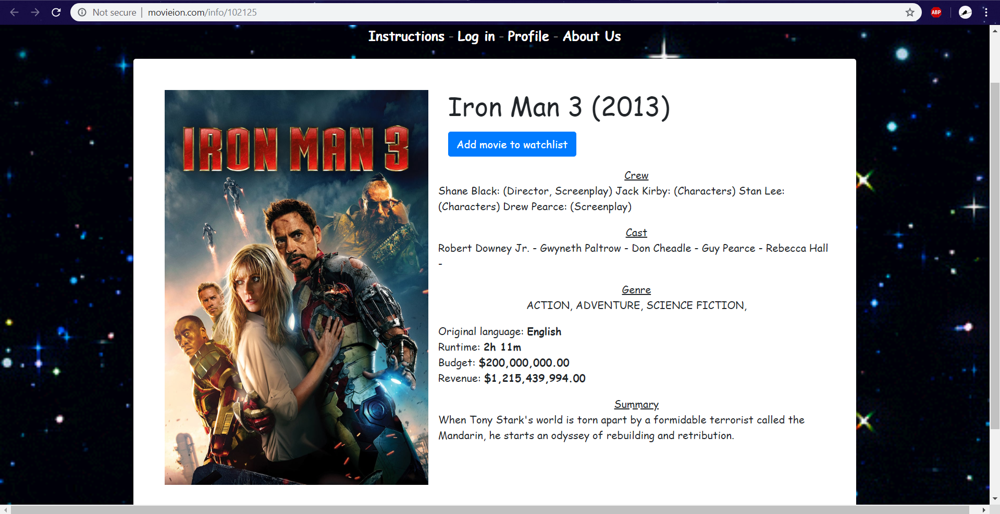

# Introduction:
Movie Matchmaker is a group project for Washington Univeristy's Data Analytics Boot Camp. For this project, we created a web app that uses a machine learning model to recommend movies. For a short while, the app will be available online at www.movieion.com. Below is an overview and demonstration of the app.

# Description:
Users submit three movies then the app will give 5 recommendations for each movie submitted. Prior to movie submission, users can toggle/invert the webpage's background image which will tell the app to either recommend movies that the user will likely enjoy or to recommend movies that they will probably dislike. The default background image will return likeable recommendations and the inverted image will return unlikeable recommendations.

Upon recieving recommendations, users can hover over a movie poster to view its cosine distance. Users can also click on a movie poster to view information about the movie.

In addition to providing recommendations, the app also allows users to save movies to a watchlist after viewing information about a movie. Currently, the watchlist doesn't have third party functionality (e.g. integrating to Netflix, Hulu, etc), but it is a potential update.

# Technologies used:

   - IDEs (VS Code and Jupyter Notebook)
   - Web Scraping (Python-Splinter)
   - Data Wrangling (Pandas, pgAdmin)
   - Machine Learning (sklearn, scipy, and joblib)
   - Storage (PostgreSQL and S3 Bucket)
   - Backend (Python-Flask)
   - Frontend (JavaScript, Bootstrap 4, HTML5/CSS3, jQuery, ajax)
   - Web Host (AWS)
   
# Unforeseen Challenges:
   - Certain libraries were incompatible with web host, namely psycopg2.
   Solution: Luckily found an alternative (pg8000)
   - A dataset required a new library to properly clean and use.
   Solution: import ast
   - Machine learning model required more RAM than standard web app, therefore sustainability, price, and processing speed were issues.
   Solution: Limit certain features and upgrade server, but ony keep website live for a limited time.
   - Bootstrap library was not compatible with familiar Flask and JavaScript techniques.
   Solution: Learn minimal ajax and JQuery
   - Bootstrap library was transforming data.
   Solution: Identify conversion pattern then re-convert affected data.

# DEMONSTRATION:
# Home Screen

# Home Screen (After Toggle):

# Searching for Year One

# After selecting Year One

# Searching for Pacific Rim

# After selecting Pacific Rim and 500 Days of Summer

# After clicking submit button

# Results (View 1)

# Results (View 2)

# Results (View 3)

# After selecting a movie result (Example 1)

# After selecting a movie result (Example 2)

# After selecting a movie result (Example 3)

# User log in (Demo version)

# User profile (Demo version)

# Movie selections (After Toggle)

# Movie submit (After Toggle)

# Results (View 1) (After Toggle)

# Results (View 2) (After Toggle)

# Results (View 3) (After Toggle)

# After selecting a movie result (After Toggle)

# After adding movie to watchlist

# User Profile (After adding three movies to watchlist)

# User Profile (After removing two movies from watchlist)

(Last updated 7/25/2019)
