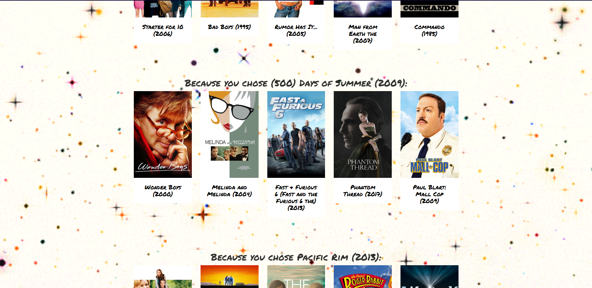

# Introduction:

Movie Ion (originally named Movie Matchmaker) is a group project for Washington University's Data Analytics Boot Camp (2019). For this project, we created a web application that uses a machine learning model to recommend movies. Below is an overview and demonstration of the application.

# Team (by GitHub username)

- @feldsteina
- @kamilevy
- @dperkins2315
- @theodoremoreland

# Description:

Users submit three movies then the app will give 5 recommendations for each movie submitted. Prior to movie submission, users can toggle/invert the webpage's background image which will tell the app to either recommend movies that the user will likely enjoy or to recommend movies that they will probably dislike. The default background image will return likeable recommendations and the inverted image will return unlikeable recommendations.

Upon recieving recommendations, users can hover over a movie poster to view its cosine distance. Users can also click on a movie poster to view information about the movie.

In addition to providing recommendations, the app also allows users to save movies to a watchlist after viewing information about a movie. Currently, the watchlist doesn't have third party functionality (e.g. integrating to Netflix, Hulu, etc), but it is a potential update.

# Technologies used:

- Web Scraping (Python-Splinter)
- Data Wrangling (Pandas, SQL)
- Machine Learning (sklearn, scipy, and joblib)
- Storage (PostgreSQL and S3 Bucket)
- Backend (Python-Flask)
- Frontend (JavaScript, Bootstrap 4, HTML5/CSS3, jQuery, ajax)
- Web Host (AWS)

# Known bugs

- Some movies don't play well with the ML model and will silently fail on the UI, only made evident by an infinite loading animation. This can be remedied by refreshing the page and avoiding the selection of movies that previously caused the failure. Movies known to cause issues include:
  - Terminator 3
  - Clueless (1995)

# Note to developers:

If intending to run this codebase locally, here are a few things to note.

- joblib models can only be used by the same version of joblib, sklearn, scikit-learn that created them.
- Certain versions of joblib, sklearn, scikit-learn are not compatible with newer versions of Python.
- Certain versions of joblib, sklearn, scikit-learn are not compatible with each other nor this codebase.
- The requirements.txt file contains the last versions of joblib, sklearn, scikit-learn that are compatible with each other and this codebase.
- As of this writing, Python 3.9 and above are not compatible with versions listed in requirements.txt and thus Python 3.8 is being used.
- The joblib models are very large in size (relative to a standard GitHub repo), approx 700MB in total. Because of their large file size, they are not being tracked by git/GitHub. The models will be available via AWS s3 soon.
- The `scripts/create_ML_models.py` script can be used to create new models, however much of the data needed for model creation have to first be web scraped and created via files in the `notebooks/` folder which have been deprecated for years and thus is likely not worth the effort.

# DEMONSTRATION:

# Home Screen

# Home Screen (After Toggle):

# Searching for Year One

# After selecting Year One

# Searching for Pacific Rim

# After selecting Pacific Rim and 500 Days of Summer

# After clicking submit button

# Results (View 1)

# Results (View 2)

# Results (View 3)

# After selecting a movie result (Example 1)

# After selecting a movie result (Example 2)

# After selecting a movie result (Example 3)

# User log in (Demo version)

# User profile (Demo version)

# Movie selections (After Toggle)

# Movie submit (After Toggle)

# Results (View 1) (After Toggle)

# Results (View 2) (After Toggle)

# Results (View 3) (After Toggle)

# After selecting a movie result (After Toggle)

# After adding movie to watchlist

# User Profile (After adding three movies to watchlist)

# User Profile (After removing two movies from watchlist)

