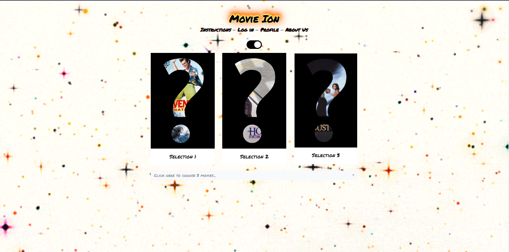

# Introduction:
Movie Ion is a group project for Washington Univeristy's Data Analytics Boot Camp. For this project, we created a web application that uses a machine learning model to recommend movies. Below is an overview and demonstration of the application.

# Team (by GitHub username)
- @feldsteina
- @kamilevy
- @dperkins2315
- @theodoremoreland

# Description:
Users submit three movies then the app will give 5 recommendations for each movie submitted. Prior to movie submission, users can toggle/invert the webpage's background image which will tell the app to either recommend movies that the user will likely enjoy or to recommend movies that they will probably dislike. The default background image will return likeable recommendations and the inverted image will return unlikeable recommendations.

Upon recieving recommendations, users can hover over a movie poster to view its cosine distance. Users can also click on a movie poster to view information about the movie.

In addition to providing recommendations, the app also allows users to save movies to a watchlist after viewing information about a movie. Currently, the watchlist doesn't have third party functionality (e.g. integrating to Netflix, Hulu, etc), but it is a potential update.

# Technologies used:
   - Web Scraping (Python-Splinter)
   - Data Wrangling (Pandas, SQL)
   - Machine Learning (sklearn, scipy, and joblib)
   - Storage (PostgreSQL and S3 Bucket)
   - Backend (Python-Flask)
   - Frontend (JavaScript, Bootstrap 4, HTML5/CSS3, jQuery, ajax)
   - Web Host (AWS)

# DEMONSTRATION:

# Home Screen

# Home Screen (After Toggle):

# Searching for Year One

# After selecting Year One

# Searching for Pacific Rim

# After selecting Pacific Rim and 500 Days of Summer

# After clicking submit button

# Results (View 1)

# Results (View 2)

# Results (View 3)

# After selecting a movie result (Example 1)

# After selecting a movie result (Example 2)

# After selecting a movie result (Example 3)

# User log in (Demo version)

# User profile (Demo version)

# Movie selections (After Toggle)

# Movie submit (After Toggle)

# Results (View 1) (After Toggle)

# Results (View 2) (After Toggle)

# Results (View 3) (After Toggle)

# After selecting a movie result (After Toggle)

# After adding movie to watchlist

# User Profile (After adding three movies to watchlist)

# User Profile (After removing two movies from watchlist)

